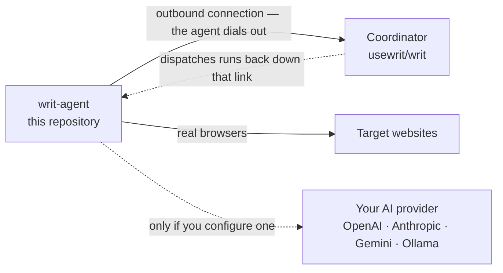

<div align="center">
  

  <br/>

  <p align="center">
    <a href="https://github.com/usewrit/writ-agent/actions/workflows/ci.yml"></a>
    <a href="https://github.com/usewrit/writ-agent/releases"></a>
    <a href="./LICENSE"></a>
    
    
  </p>

  <h3 align="center">The browser-automation worker that runs on your hardware.</h3>

  <p align="center">
    <a href="#quick-start"><b>Quick start</b></a> ·
    <a href="#what-it-does"><b>What it does</b></a> ·
    <a href="#what-it-talks-to"><b>What it talks to</b></a> ·
    <a href="./docs/CONFIGURATION.md"><b>Configuration</b></a> ·
    <a href="./SECURITY.md"><b>Security</b></a>
  </p>
</div>

---

**writ-agent** is the worker half of [Writ](https://github.com/usewrit/writ). It records and
replays browser workflows, runs AI-assisted browsing against *your* model provider, crawls sites,
and keeps every credential in an encrypted local store — all on hardware you control. A fleet of
these workers dials out to your coordinator, which deploys workflows to them and dispatches runs;
the workers do the browsing.

> **You need the coordinator too.** [`usewrit/writ`](https://github.com/usewrit/writ) is the
> open-source control plane — it serves the web UI and API and holds your data. Deploy it first,
> then point one or more of these agents at it. This repository is the worker only; it has no UI
> and no database of your workflows.

## Why run your own agent

- **The browsing happens on your machines.** Cookies, sessions, logins and page content stay on
  the host you started the worker on. Nothing is proxied through anyone else's fleet.
- **No inbound ports.** The worker opens one outbound connection to your coordinator. It works
  behind NAT, on a laptop, in a container — no firewall holes, no public DNS.
- **Bring your own AI key.** Prompts and page content go **directly** from your machine to the
  provider you configured (OpenAI, Anthropic, Gemini, any OpenAI-compatible endpoint, or a local
  Ollama). There is no middleman inference service.
- **Unpack and run.** No runtime to install, no Python environment, no supervisor required — one
  binary and the browser driver that ships beside it in the same archive. Chromium installs itself
  on first use.
- **Open source, AGPL-3.0.** Read it, fork it, run it.

## What it does

| | Capability |
| --- | --- |
| 🎬 **Record** | Drive a real browser and capture the flow — logins, forms, clicks, extractions — as a replayable workflow. |
| ▶️ **Replay** | Run the workflows your coordinator dispatches, and return structured data. |
| 🕸️ **Crawl** | Take a share of a distributed crawl across your fleet. |
| 📄 **Read documents** | Extract text from PDFs, office files and scanned pages encountered along the way. |
| 🔭 **Monitor** | Run the change and uptime checks assigned to this worker. |
| 🤖 **AI-assist** | Let a model explore a page, repair a broken selector, or drive a task — on your key, against your provider. |

## How it fits together



The arrow direction is the point: **the agent connects to the coordinator**, never the other way
round. Nothing needs to reach the worker from outside — the coordinator sends work back down the
connection the worker already opened.

---

## Quick start

### 1. Get a token

In the coordinator UI go to **Fleet → "Connect a new agent"**. That page shows a ready-made command
with everything below already filled in — copying it is the fastest path.

### 2. Set the environment

| Variable | Required | Meaning |
|----------|----------|---------|
| `WRIT_SERVICE_TOKEN` | **yes** | The token you just minted. |
| `WRIT_COORDINATOR_URL` | **yes** | Your coordinator's base URL, e.g. `https://coordinator.example.com`. |
| `WRIT_HOME` | no | Data directory (default `~/.writ`) — holds the encrypted database and key file. |
| `WRIT_USE_KEYRING` | no | Root the encryption key in the OS keyring instead of a key file. |
| `WRIT_FLEET_ALLOW_INSECURE` | no | Allow plaintext `http://` to a remote coordinator (trusted networks only; refused otherwise). |
| `WRIT_AI_KEYS_CONFIGURED` | no | Tell the coordinator this worker can run AI-assisted tasks. |
| `WRIT_FLEET_STATUS_PORT` | no | Serve a loopback-only health endpoint on this port (see below). |

Every available setting is documented in [`docs/CONFIGURATION.md`](./docs/CONFIGURATION.md).

### 3. Run it

**From a release archive** ([Releases](https://github.com/usewrit/writ-agent/releases) — Linux
x86_64/aarch64, macOS arm64/x86_64, Windows x86_64, each with a SHA-256 sidecar):

```sh
tar -xzf writ-agent-fleet-linux-x86_64.tar.gz
cd writ-agent-fleet-linux-x86_64

export WRIT_SERVICE_TOKEN=<token from the coordinator>
export WRIT_COORDINATOR_URL=https://coordinator.example.com
./writ-agent-fleet
```

> The archive holds the binary **and** the browser driver it needs. Keep them together — the worker
> finds the driver beside its own executable, so there is nothing to configure, but a binary moved
> out on its own has no browser to launch. Chromium installs itself on first use.

**With Docker:**

```sh
docker run -d --name writ-agent \
  -e WRIT_SERVICE_TOKEN=<token from the coordinator> \
  -e WRIT_COORDINATOR_URL=https://coordinator.example.com \
  -e WRIT_HOME=/data \
  -e WRIT_FLEET_STATUS_PORT=8132 \
  -v writ-agent-data:/data \
  --health-cmd "wget -qO- http://127.0.0.1:8132/healthz || exit 1" \
  --health-interval 30s --health-timeout 5s --health-retries 3 \
  ghcr.io/usewrit/writ-agent:latest
```

**From source** — see [`CONTRIBUTING.md`](./CONTRIBUTING.md) for the toolchain and build steps.

### Health endpoint

Set `WRIT_FLEET_STATUS_PORT=<port>` and the worker serves a **loopback-only** (`127.0.0.1`)
endpoint: `GET /healthz` returns `{status, connected, uptime_s, last_task_at, version}` and answers
HTTP `503` while disconnected from the coordinator. Point a Docker `HEALTHCHECK` (as above) or a
systemd watchdog at it.

### Running more work per host

A worker takes a small number of background runs at a time by default. You can raise that — see
`WRIT_MAX_CONCURRENT_RUNS` and `WRIT_MAX_BACKGROUND_RUNS` in
[`docs/CONFIGURATION.md`](./docs/CONFIGURATION.md) — or simply start more workers. They are
independent of one another; give each its own `WRIT_HOME`.

---

## What it talks to

The agent makes **no** outbound calls you did not configure.

| Destination | When |
|-------------|------|
| Your coordinator (`WRIT_COORDINATOR_URL`) | Always — the one link it opens. TLS verified; sending the token in plaintext to a remote host is refused unless you explicitly opt in. |
| Your AI provider — `api.openai.com`, `api.anthropic.com`, Gemini, an OpenAI-compatible endpoint, or a local Ollama | Only when you have configured a provider **and** a task uses it. Prompts and page content go **directly** from your machine on **your** key. |
| The Chromium project's download bucket | First browser use only, if no browser is found. The agent fetches open-source Chromium over HTTPS and verifies it against a checksum built into the binary, refusing to install on a mismatch. Pre-install into `PLAYWRIGHT_BROWSERS_PATH` to skip it; the container image already ships a browser. |
| The sites your workflows target | When you run them. |

There is no analytics, no phone-home, and no update check. Usage telemetry is off unless you both
opt in and supply your own endpoint — there is no built-in destination.

For the finer points — what monitoring stores, how long data is kept, what the browser flags do —
see [`docs/DISCLOSURES.md`](./docs/DISCLOSURES.md).

## Security

- Your data lives in an **encrypted database** on your own disk; the key is held either in the OS
  keyring or a `0600` file inside a `0700` directory. Individual secrets are sealed separately.
- TLS is verified. There is no certificate bypass for the coordinator link.
- Logs pass through a redaction layer before anything is written.

To report a vulnerability, use GitHub's private **"Report a vulnerability"** flow on this
repository — see [`SECURITY.md`](./SECURITY.md). Please do not open a public issue for security
reports.

## Community & support

- **Questions, setup help, show & tell** — [GitHub Discussions](https://github.com/usewrit/writ-agent/discussions).
- **Bugs & feature requests** — [GitHub Issues](https://github.com/usewrit/writ-agent/issues).
- **Security issues** — report privately, see [`SECURITY.md`](./SECURITY.md).
- **Coordinator questions** belong in [`usewrit/writ`](https://github.com/usewrit/writ) — the UI,
  API, scheduling and storage all live there.

## Contributing

Issues and pull requests are welcome — start with [`CONTRIBUTING.md`](./CONTRIBUTING.md) and the
[Code of Conduct](./CODE_OF_CONDUCT.md). Released changes are recorded in
[`CHANGELOG.md`](./CHANGELOG.md).

## License

Copyright © 2026 The Writ Project Authors.

Licensed under the **GNU Affero General Public License, version 3** (`AGPL-3.0-only`) — see
[`LICENSE`](./LICENSE).

**AGPL-3.0 §13 — the network source offer.** If you modify this agent and let anyone else interact
with it over a network, you owe them the complete corresponding source of **your** modified version.

Third-party license notices for Rust dependencies are in
[`THIRD_PARTY_NOTICES.md`](./THIRD_PARTY_NOTICES.md); the programs redistributed as binaries (the
browser drivers, Node.js, Chromium) are attributed in
[`BUNDLED_BINARIES.md`](./BUNDLED_BINARIES.md). All are permissively licensed and shipped
unmodified; **no dependency of this project is AGPL** — that license is ours alone.

The Writ name, wordmark, glyph and tile are trademarks and are **not** covered by the AGPL grant —
read that file before rebranding a fork.
