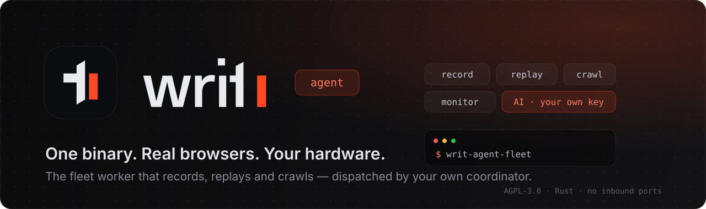
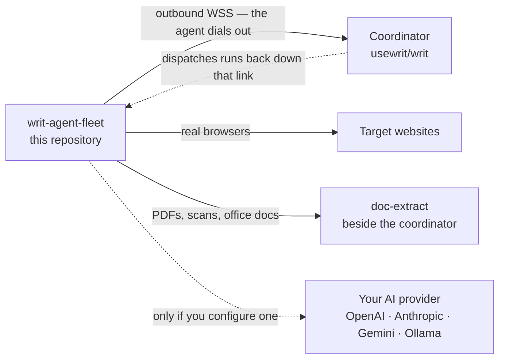

<div align="center">
  

  <br/>

  <p align="center">
    <a href="https://github.com/usewrit/writ-agent/actions/workflows/ci.yml"></a>
    <a href="https://github.com/usewrit/writ-agent/releases"></a>
    <a href="./LICENSE"></a>
    
    
    
    
  </p>

  <h3 align="center">The browser-automation worker that runs on your hardware.</h3>

  <p align="center">
    <a href="#quick-start-self-host-fleet-worker"><b>Quick start</b></a> ·
    <a href="#what-it-does"><b>What it does</b></a> ·
    <a href="#the-four-binaries"><b>Binaries</b></a> ·
    <a href="#network-destinations"><b>Network</b></a> ·
    <a href="./docs/CONFIGURATION.md"><b>Configuration</b></a> ·
    <a href="./SECURITY.md"><b>Security</b></a>
  </p>
</div>

---

**writ-agent** is the worker half of [Writ](https://github.com/usewrit/writ). It records and
replays browser workflows, runs AI-assisted browsing against *your* model provider, executes
crawl shards, and keeps every credential in a SQLCipher-encrypted local store — all on hardware
you control. A fleet of these workers dials out to your self-host coordinator, which deploys
workflows to them and dispatches runs; the workers do the browsing.

> **You need the coordinator too.** [`usewrit/writ`](https://github.com/usewrit/writ) is the
> open-source control plane — it serves the web UI and API and holds your data. Deploy it
> first, then point one or more of these agents at it. This repository is the worker only;
> it has no UI and no database of your workflows.

## Why run your own agent

- **The browsing happens on your machines.** Cookies, sessions, logins and page content stay
  on the host you started the worker on. Nothing is proxied through anyone else's fleet.
- **No inbound ports.** The worker opens one outbound WSS connection to your coordinator.
  It works behind NAT, on a laptop, in a container, with no firewall holes and no public DNS.
- **Bring your own AI key.** Prompts and page content go **directly** from your machine to
  the provider you configured (OpenAI, Anthropic, Gemini, any OpenAI-compatible endpoint, or
  a local Ollama). There is no middleman inference service.
- **Unpack and run.** No runtime to install, no Python environment, no daemon supervisor
  required — one binary and the Playwright driver that ships beside it in the same archive.
  Chromium installs itself on first browser use.
- **Cloud-free by construction.** The `fleet` feature and the managed-cloud `cloud` feature
  are a hard `compile_error!` together — the build you run *cannot* contain cloud code, and
  you can check that with `cargo tree`, not just take our word for it.
- **Open source, AGPL-3.0.** Read it, fork it, run it.

## What it does

| | Capability |
| --- | --- |
| 🎬 **Record** | Drive a real browser and capture the flow — logins, forms, clicks, extractions — as a replayable workflow. |
| ▶️ **Replay** | Run saved workflows the coordinator dispatches, and return structured data. |
| 🕸️ **Crawl** | Execute crawl shards for a distributed **Harvest** crawl across the fleet. |
| 📄 **Read documents** | Hand PDFs, office files and scanned pages to the coordinator's extractor — its address is handed to the worker at connect time, so there is nothing to configure. |
| 🔭 **Monitor** | Run the change/uptime checks the coordinator assigns to this worker (`content`, `uptime`, `playwright` modes). |
| 🤖 **AI-assist** | Let a model explore, repair a broken selector, or drive a task — on your key, against your provider. |

## How it fits together



The arrow direction is the point: **the agent connects to the coordinator**, never the other
way round. Nothing needs to reach the worker from outside — the coordinator dispatches work
back down the connection the worker already opened.

---

## Quick start (self-host fleet worker)

The OSS binary is **`writ-agent-fleet`** — a pure execution node. It opens an outbound
HTTPS/WSS link to your coordinator and runs the workflows the coordinator dispatches to it.
No inbound ports are required.

### 1. Mint a fleet token

In the coordinator UI go to **Fleet → "Connect a new agent"**. This mints the long-lived
fleet token the worker authenticates with. (The command that page shows you already contains
everything below, filled in — copying it is the fastest path.)

### 2. Set the environment

| Variable | Required | Meaning |
|----------|----------|---------|
| `WRIT_SERVICE_TOKEN` | **yes** | The fleet token you just minted. |
| `WRIT_COORDINATOR_URL` | **yes** | Coordinator HTTP(S) **base** URL (e.g. `https://coordinator.example.com`). The worker POSTs `<base>/api/recorder/connect` and dials the WebSocket handed back. (`SAAS_URL` is a legacy alias.) |
| `WRIT_HOME` | no | Data directory (default `~/.writ`) — holds the SQLCipher-encrypted `writ.db` and the `0600 vault.key`. |
| `WRIT_USE_KEYRING` | no | Opt in to rooting the vault key in the OS keyring instead of the key file. |
| `WRIT_FLEET_ALLOW_INSECURE` | no | Allow plaintext `http://` to a non-loopback coordinator (trusted networks only; refused otherwise). |
| `WRIT_AI_KEYS_CONFIGURED` | no | Advertise BYO-AI capability to the coordinator. |
| `WRIT_FLEET_STATUS_PORT` | no | Expose a loopback-only `GET /healthz` status endpoint on this port (see below). |

Full reference — every environment variable and `config.toml` field:
[`docs/CONFIGURATION.md`](./docs/CONFIGURATION.md).

### 3. Run it

**From a release archive** ([Releases](https://github.com/usewrit/writ-agent/releases) — Linux
x86_64/aarch64, macOS arm64/x86_64, Windows x86_64, each with a SHA-256 sidecar):

```sh
tar -xzf writ-agent-fleet-linux-x86_64.tar.gz
cd writ-agent-fleet-linux-x86_64

export WRIT_SERVICE_TOKEN=<token from the coordinator>
export WRIT_COORDINATOR_URL=https://coordinator.example.com
./writ-agent-fleet
```

> The archive holds the binary **and** the Playwright driver it drives
> (`playwright-driver/`). Keep the two together — the worker looks for the driver beside its own
> executable, so no configuration is needed, but a binary moved out of the directory on its own
> has no browser to launch. (`WRIT_HOME/playwright-driver` works as well, and
> `PLAYWRIGHT_DRIVER_PATH` overrides both.) Chromium itself installs on first browser use.

**With Docker** (`ghcr.io/usewrit/writ-agent:latest` runs the fleet worker):

```sh
docker run -d --name writ-agent \
  -e WRIT_SERVICE_TOKEN=<token from the coordinator> \
  -e WRIT_COORDINATOR_URL=https://coordinator.example.com \
  -e WRIT_HOME=/data \
  -e WRIT_FLEET_STATUS_PORT=8132 \
  -v writ-agent-data:/data \
  --health-cmd "wget -qO- http://127.0.0.1:8132/healthz || exit 1" \
  --health-interval 30s --health-timeout 5s --health-retries 3 \
  ghcr.io/usewrit/writ-agent:latest
```

**From source** (Rust 1.88+):

```sh
cargo build --release --no-default-features --features local,fleet,openai --bin writ-agent-fleet
./target/release/writ-agent-fleet
```

### Health / status endpoint

Set `WRIT_FLEET_STATUS_PORT=<port>` and the worker serves a **loopback-only** (`127.0.0.1`)
status endpoint: `GET /healthz` returns JSON
`{status, connected, uptime_s, last_task_at, version}` and answers HTTP `503` while
disconnected from the coordinator. Point a Docker `HEALTHCHECK` (as above) or a systemd
watchdog at it.

### Throughput

A worker advertises `max_background_runs` (default **2**) to the coordinator. Raise
`WRIT_MAX_CONCURRENT_RUNS` / `WRIT_MAX_BACKGROUND_RUNS` to let one host take more work,
or just start more workers — they are independent and stateless with respect to each other.

---

## The four binaries

One crate, four binaries, selected by feature flags:

| Binary | Features | Role |
|--------|----------|------|
| **`writ-agent-fleet`** | `local,fleet` | **The self-host fleet worker — the binary OSS users run.** Connects out to your coordinator; pure execution node (no local HTTP server, scheduler, or monitors). |
| `writ-agentd` | `local` | The local desktop daemon: SQLCipher store, vault, loopback HTTP/WS API (`127.0.0.1:8131`), scheduler, monitors. |
| `writ` | `local` | The local control CLI for the daemon. |
| `writ-agent` | `cloud` | The managed cloud agent (what a bare `cargo build` produces — *not* the self-host build). |

Cargo only compiles a binary when its `required-features` are enabled, so the
`local,fleet,openai` build never touches the cloud code paths.

## Feature flags

> **`cloud` is a default feature** — a bare `cargo build` produces the managed cloud agent,
> not the self-host worker. Always pass `--no-default-features --features local,fleet,openai`
> for the OSS build.

This is **every** feature the crate declares — including the ones that are off, because "what
is *not* compiled in" is the part worth being able to check.

| Feature | Default? | What it turns on |
|---------|----------|------------------|
| `cloud` | yes | The managed cloud agent + the desktop cloud-link (bridge / server / gateway / streaming / cloud API routers). |
| `openai` | yes | The `async-openai` provider client. |
| `local` | no | The local engine: SQLCipher store, vault, HTTP/WS API, scheduler, monitors. |
| `fleet` | no | The self-host fleet worker's coordinator link. **Cloud-free by construction.** |
| `captcha_solver` | **no** | Automated CAPTCHA solving — a managed-cloud feature whose **source is not in this repository**. Enabling it here fails to compile; `automation::step_captcha` falls back to its detection-only arm (`captcha_required`). See [`docs/DISCLOSURES.md`](./docs/DISCLOSURES.md) §3. |
| `ip_relay` | **no** | A residential-proxy egress node — a deferred managed-cloud capability whose **source is not in this repository** either. Listed so its absence is verifiable. |
| `update-test-keys` | **no** | Test-only. Compiles a deterministic keypair so `tests/update_verify.rs` can verify manifests it signs itself. Never in a release feature set. |

`cloud` and `fleet` are **mutually exclusive** — enabling both is a hard `compile_error!`
(`src/lib.rs`), so the fleet build cannot carry cloud code.

```sh
# Self-host fleet worker (the OSS build):
cargo build --release --no-default-features --features local,fleet,openai --bin writ-agent-fleet

# Desktop daemon + CLI (local engine, no cloud, no fleet):
cargo build --no-default-features --features local,openai

# Managed cloud agent (what a bare `cargo build` gives you):
cargo build
```

<details>
<summary><b>How the Playwright driver gets into the build (and how to build offline)</b></summary>

<br/>

The vendored `playwright-rs` (`vendor/playwright-rs`, wired in via `[patch.crates-io]`)
fetches the Playwright Node.js driver at **build time** from the PyPI `playwright` wheel —
which bundles exactly the same `node` + `package/cli.js` payload that `playwright-python`
ships — and verifies it against a **pinned SHA-256** (PyPI's own published digest). The build
**fails** if the driver cannot be obtained; it never produces a binary that cannot launch a
browser. The vendored fork exists so a stealth (patchright) driver can be substituted at
runtime. Chromium itself is installed on first browser use via the bundled driver CLI.

| Variable | Effect |
|----------|--------|
| `PLAYWRIGHT_DRIVER_PATH` | Use an already-extracted driver directory (must contain `node` and `package/cli.js`). Checked **before** any network access and before any cache, so the build stays fully offline and an explicit override always wins. |
| `PLAYWRIGHT_DRIVER_URL` + `PLAYWRIGHT_DRIVER_SHA256` | Fetch the archive from your own mirror. Both are required together — a URL without a digest is a hard error rather than a silently unverified download. Either a PyPI wheel or a legacy Playwright driver ZIP is accepted. |

The driver is also cached in `~/.cache/playwright-rs-driver/` so it survives `cargo clean`
and lockfile churn.

</details>

---

## Network destinations

The agent makes **no** outbound calls you did not configure, except the build-time driver
download. Every destination:

| Host / destination | When | Notes |
|--------------------|------|-------|
| Your coordinator (`WRIT_COORDINATOR_URL`) | Fleet worker, always. | The only control-plane link in the fleet build. TLS verified; plaintext to non-loopback is refused unless `WRIT_FLEET_ALLOW_INSECURE=1`. |
| `https://api.usewrit.app` | **Only** if you link the *desktop daemon* to Writ Cloud (optional). | Default cloud base URL; override with `WRIT_CLOUD_URL`. HTTPS required. The `fleet` build has no cloud link at all. |
| `api.openai.com`, `api.anthropic.com`, `generativelanguage.googleapis.com` (Gemini), or your OpenAI-compatible / Ollama endpoint | Only when you configure an AI provider **and** run an AI-assisted task. | Prompts + page DOM/screenshots go **directly** to *your* provider on *your* key — never through anyone else's infrastructure. |
| `https://files.pythonhosted.org` (PyPI) | **Build time** (`vendor/playwright-rs/build.rs`). | The `playwright` wheel, from which the bundled Node.js driver is extracted. **SHA-256 pinned** against PyPI's published digest; the archive contains a `node` binary that is later executed, so the pin is the supply-chain anchor. Redirect to a mirror with `PLAYWRIGHT_DRIVER_URL` + `PLAYWRIGHT_DRIVER_SHA256`, or skip the download entirely with `PLAYWRIGHT_DRIVER_PATH`. |
| `https://pypi.org` + `https://files.pythonhosted.org` | **Docker image build only** (`Dockerfile`). | `pip install "patchright==1.60.*"` in a throwaway venv, to stage the stealth driver into the image. Version-pinned to the 1.60 line (patchright bundles `playwright-core` 1.60, the wire protocol the vendored bindings speak) but **not digest-pinned** — see [`docs/DISCLOSURES.md`](./docs/DISCLOSURES.md) §5. Building the image is the only thing that does this; release binaries and `cargo build` never do. |
| Chromium download | First browser use, via the bundled driver CLI. | See [`docs/DISCLOSURES.md`](./docs/DISCLOSURES.md) §5 "Silent binary / package downloads". Pre-install into `PLAYWRIGHT_BROWSERS_PATH` to avoid it entirely; the container image already does. |
| Telemetry endpoint | Never, by default. | Telemetry is **default no-op**: it requires both `WRIT_TELEMETRY` opt-in **and** a configured `WRIT_TELEMETRY_DSN`. There is no built-in DSN. |
| The sites your workflows target | When you run them. | Whatever URLs you automate. |

There is no analytics, phone-home, or update-check host beyond the above.

## Security

Highlights of the posture (details in [`SECURITY.md`](./SECURITY.md) and
[`docs/DISCLOSURES.md`](./docs/DISCLOSURES.md)):

- Local data is stored in a **SQLCipher-encrypted** database; key custody is an OS keyring
  (opt-in) or a `0600` key file inside a `0700` home directory. Secret values are sealed with
  XChaCha20-Poly1305 + Argon2id, with the AAD bound to the row they belong to.
- TLS is verified — there is no insecure-certificate bypass for the coordinator link, and the
  worker refuses to send its token over plaintext to a non-loopback host without an explicit
  opt-in.
- Logs pass through a redaction layer before they are written.
- There is **no `unsafe` code** in `src/`, no shell interpolation in any of the process-spawn
  sites, and no archive extraction at runtime.
- Supply chain: `cargo deny` (advisories, licenses, bans, sources) runs on every PR and
  weekly on a schedule; third-party notices are generated from the locked dependency graph
  with `cargo-about`. See [`deny.toml`](./deny.toml) and
  [`.cargo/audit.toml`](./.cargo/audit.toml) for the exception policy — every entry carries a
  reason, a way to verify it, an owner, and an expiry date.

To report a vulnerability, use GitHub's private **"Report a vulnerability"** flow on this
repository — see [`SECURITY.md`](./SECURITY.md). Please do not open a public issue for
security reports.

## What's in the repository

| Path | What it is |
| --- | --- |
| `src/` | The agent: browser engine, local store + vault, fleet bridge, crawl shard, AI providers. |
| `src/bin/` | The binaries — `writ-agent-fleet`, `writ-agentd`, `writ`. |
| `migrations/` | SQLite/SQLCipher schema migrations for the local store. |
| `vendor/playwright-rs/` | The vendored Playwright client fork (patched in via `[patch.crates-io]`). |
| `js/` | Injected browser-side scripts (recorder, extraction, stealth). |
| `tests/` | Integration tests — record/replay, migration quarantine, update-signature verification, OpenAI/MCP conformance, the cipher gate, offline-first behaviour. |
| `docs/` | [`CONFIGURATION.md`](./docs/CONFIGURATION.md) (every env var + `config.toml` field) and [`DISCLOSURES.md`](./docs/DISCLOSURES.md) (what the browser flags do, what monitoring stores, retention). |
| `deny.toml` · `about.toml` | Supply-chain policy and third-party-notice generation. |
| `Dockerfile` | The image published as `ghcr.io/usewrit/writ-agent`. |

## Community & support

- **Questions, setup help, show & tell** — [GitHub Discussions](https://github.com/usewrit/writ-agent/discussions).
- **Bugs & feature requests** — [GitHub Issues](https://github.com/usewrit/writ-agent/issues); templates are provided.
- **Security issues** — report privately, see [`SECURITY.md`](./SECURITY.md).
- **Coordinator questions** belong in [`usewrit/writ`](https://github.com/usewrit/writ) — the
  UI, API, scheduling and storage all live there.

## Contributing

Issues and pull requests are welcome. Please read [`CONTRIBUTING.md`](./CONTRIBUTING.md) and
the [Code of Conduct](./CODE_OF_CONDUCT.md) first, and report security issues privately per
[`SECURITY.md`](./SECURITY.md). Released changes are recorded in
[`CHANGELOG.md`](./CHANGELOG.md).

## License

Copyright © 2026 The Writ Project Authors.

Licensed under the **GNU Affero General Public License, version 3** (`AGPL-3.0-only`) — see
[`LICENSE`](./LICENSE).

**AGPL-3.0 §13 — the network source offer.** If you modify this agent and let anyone else
interact with it over a network, you owe them the complete corresponding source of **your**
modified version.

Third-party license notices are generated from the locked dependency graph with `cargo-about`
(see [`about.toml`](./about.toml)) and checked in as
[`THIRD_PARTY_NOTICES.md`](./THIRD_PARTY_NOTICES.md); CI fails if they drift. That covers Rust
crates only — the programs redistributed as **binaries** (the Playwright and patchright drivers,
Node.js, Chromium) are attributed in [`BUNDLED_BINARIES.md`](./BUNDLED_BINARIES.md), because no
Cargo tool can see them. All of them are permissively licensed and shipped unmodified; **no
dependency of this project is AGPL** — that license is ours alone.

The Writ name, wordmark, glyph and tile are trademarks and are **not** covered by the AGPL grant —
read that file before rebranding a fork.
